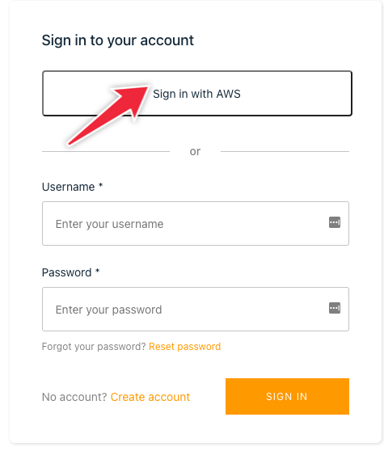
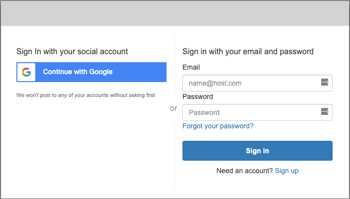

# Access

Please use the link blew to visit `flipt(ed)-webrew`.

## Website

Link to site: [https://webrew.herokuapp.com/](https://webrew.herokuapp.com/)

## How to Use the Site

1. Click the `Sign in with AWS` button 
2. In redirected page, choose `Continue with Google` and use instructor's google account to sign in.

