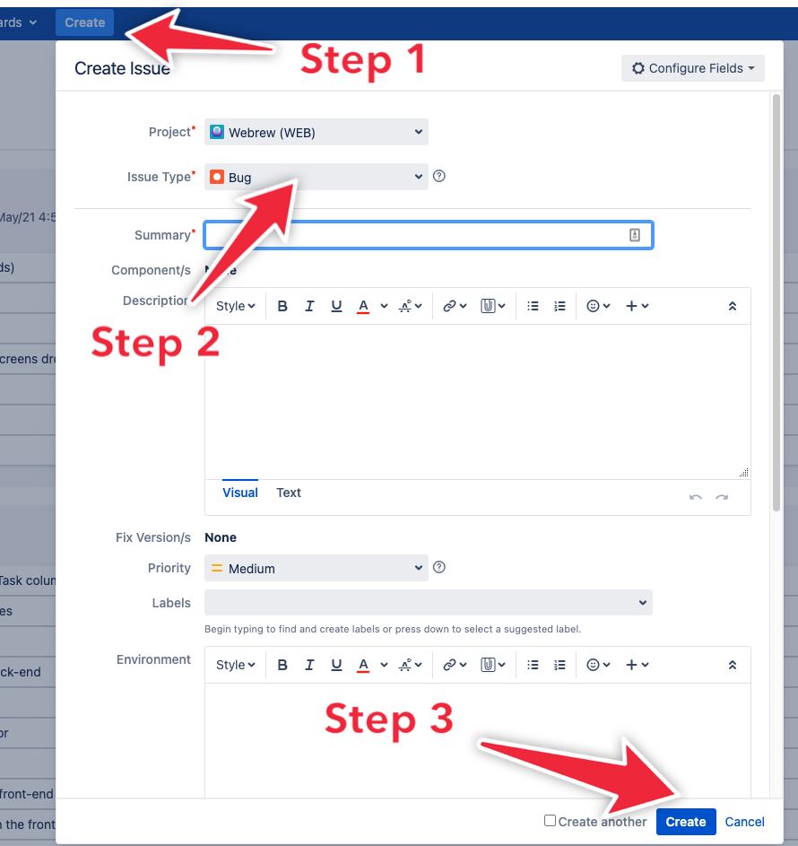

# Defect Reporting

Please follow the following steps to report any defects you find in the prototype.

First go to JIRA board homepage at [Here](http://platinum.cscaws.com:8080/secure/RapidBoard.jspa?rapidView=52&view=planning.nodetail&issueLimit=100), then

1. Click the `Create` Button in the navigation bar.
2. In the pop up window, select `Bug` for `Issue Type`.
3. Click the `Create` at the right bottom corner of the pop up window to submit the bug when you are done inputing,

   

