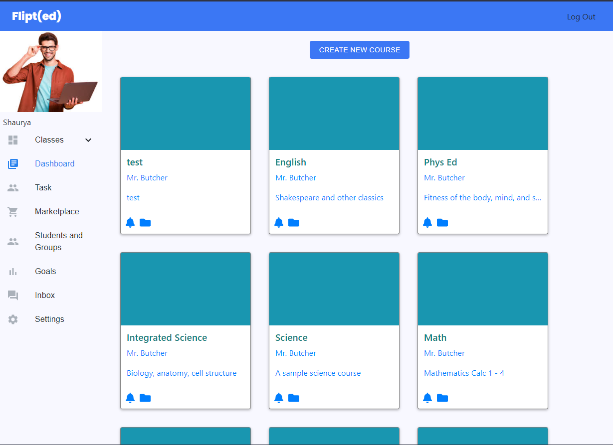

# Demo

After logging in, you'll be greeted with the home page of the Flipt\(ed\) app, which displays courses and a sidebar to help navigate the app.

Clicking on a course will take you to a Course Home Screen, where Instructors can check student progress at a glance. There's 2 views - a List View, and a Seating Chart View.

 

Clicking on a student will show that student's overall Mission Progress

Clicking on a Mission will display the Tasks in that Mission and the progress of the student.

Clicking on a Task here will show the student's submission and allow an authorized instructor to add feedback, score the task, and assign a Mastery Grade for the Learning Objective.

Clicking on Students and Groups on the Sidebar will show the Mastery Level for each student and their progress on Learning Targets

Clicking on a Learning Target will show mastery progress for Objectives.

Clicking on a row here will display Target Progress

Clicking on one of the Targets will display the color coded Task Mastery view

Clicking on Task on the Sidebar will show all possible tasks assigned and allow the Instructor to view submissions.

After clicking view under Submissions, the Instructor will be able to check and click on each student's submission and see the Task View as displayed earlier

