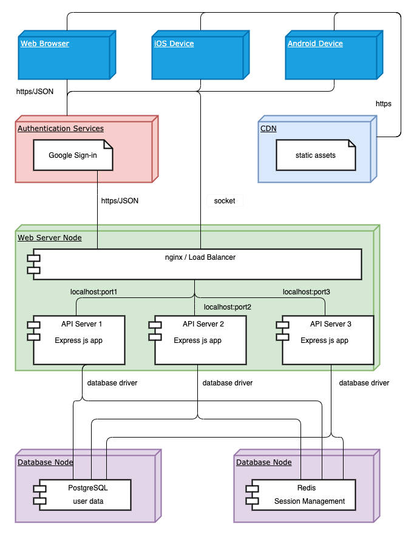

# deployment\_diagragm\_description

## Deployment Diagram Description

## Overview

The LMS will include a web version, a tablet version and a mobile version \(with limited functionalities\). All the users are requested to be authenticated through third party authentication service before accessing the LMS. Once authenticated, the client requests are then routed by a deciated proxy server to the real application server to be handled. The API will follow the RESTful style.

## Components

The diagram illustrates the fundamental components of the project.

1. Authentication Service. The system will utilize third party autentication service, such as Google Sign-in, for users to sign in. It will provide both reliability and safety.
2. CDN \(Content Distribute Network\). The CDN will host all the static assets \(images\), so our own web server will have more capability in handing API requests.
3. Web server. We wil be using nginx as the web server. nginx will server both as a reverse proxy server and as a load balancer. It will route client requests to the API servers located in the same machine or network. As a load balancer, it will use appropriate stretegy to make sure the payload are equally distributed across all the API servers. These servers sit behind a firewall and are only accessible from nginx.
4. Persistence. The system uses PostgreSQL database for persistence.
5. Session Management. Redis is a in-memory key-value database. It will be used to manage use sessions.

