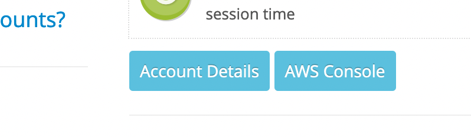

## Webrew Flipted Environment Configuration Instructions

### Description

This document will help you to configure the front and back ends of the Flipted project for team Webrew. You will need to download the AWS CLI, Node.js and Node Package Manager to run the project. The instructions for acquiring each are below. Once downloaded and configured, follow along the front and back end instructions to complete project configuration.

### Before configuring the project...

#### Platform and IDEs

+ While following the instructions below, be sure to install software of platform-specific version. (Windows/Linux/MacOS)
+ The following setup does not depend on any IDEs or code editors. However, it's suggested to have the `prettier` and `eslint` at hand. This will ensure uniform coding style and good code quality.

#### AWS

1. Download the AWS CLI version 2, follow the instructions in the docs for your specific operating system. [[Installing, updating, and uninstalling the AWS CLI version 2](https://docs.aws.amazon.com/cli/latest/userguide/install-cliv2.html)

2. Configure your default profile to be used in the AWS CLI (This will have to be updated with each session due to time limits with AWS Educate).
  a. Navigate to the Vocareum homepage for AWS Educate.<br/>
  
  b. Click `Account Details`.<br/>
  c. Click `AWS CLI`.<br/>
  d. Copy the text for your session into `~/.aws/credentials`, if you can'y access the folder, start at step f.<br/>
  e. Execute the command `aws configure --profile default` and you are authenticated.<br/>
  f. If you can't access the `.aws` folder, you can authenticate using the `aws configure` command.<br/>
  g. Type in the corresponding "Access Key" and "Secret Access Key" that is in the `Account Details` information.<br/>
  h. Type in `us-east-1` for default region.<br/>
  i. Type in `json` for default output.<br/>
  

#### Nodejs

1. Install `npmjs` and `npm`. [[npm | build amazing things]](https://www.npmjs.com/get-npm)
2. Alternative - `nvm`. See more here. [[Node Version Manager]](https://github.com/nvm-sh/nvm)

### Front End

1. Clone the webrew repo using this link for the front-end. [[webrew]](https://github.com/CPSECapstone/webrew.git)
2. Run the `npm install` command in the root of the project.
3. Run the `npm install -g @aws-amplify/cli` command to acquire the AWS Amplify CLI.
4. Run the `amplify configure` command and provide the same access keys as you did for the AWS CLI.
5. Create two new files, one called `.env.development` and `.env.production` in the root of your project.
```
# In development, add this line
REACT_APP_URI="https://j68yellpbi.execute-api.us-east-1.amazonaws.com/dev/graphql"

# In production, add this line
REACT_APP_URI="https://j68yellpbi.execute-api.us-east-1.amazonaws.com/dev/graphql"

# They are currently the same since production has not been deployed.
```

6. Run `npm start` to start the project.

#### Continuous Delivery/Continuous Integration

Withint the front end repo, a workflow is setup with **Github Actions**. The workflow includes a series of actions, spining up a runtime environement, installing dependencies, linting coding, building the project and running test suites.

**Q: How to trigger the workflow?**
**A:** The workflow will be triggered automatically on two events,
  1). any `push` to branches other than `main`.
  2). any `pull_request` to `main` branch.

**Q: Where do I check the output of the workflow**
**A:** Go to the home page of the repo, and click the `Actions`. You will set the real time workflow log and all history logs as well. If any of the workflow fails, it should not be merged back to `main` branch.

**Q: How does linting work?**
A: We use `eslint` as our linting tool. Right now we are using default setting from `eslint`. This might be changed in future.

**Q: How does testing work?**
A: We use `jest` as our test runner and `testing-library/react` to write ui test cases.

##### References

Documentations

+ [Github Actions](https://docs.github.com/en/actions)
+ [actions/setup-node](https://github.com/actions/setup-node)
+ [actions/checkout](https://github.com/actions/checkout)
+ [ESLint - Find and fix problems in your JavaScript Code](https://eslint.org/)
+ [Running Test](https://create-react-app.dev/docs/running-tests/)
+ [Jest](https://jestjs.io/)

Others
+ [Create-React-App with TypeScript, ESLint, Prettier, and Github Actions](https://brygrill.medium.com/create-react-app-with-typescript-eslint-prettier-and-github-actions-f3ce6a571c97])

### Back End

1. Clone the flipped-backend repo using this link. [[flipted-backend]](https://github.com/CPSECapstone/flipted-backend.git)
2. Run the `npm install -g serverless` command.
3. Run the `npm install` command.
4. Use the `serverless offline` command to test the back end offline.
5. When you're ready, you can deploy or redeploy with serverless deploy. To specify the stage (dev/prod), use the following `serverless deploy --stage prod` or `serverless deploy --stage dev`.
